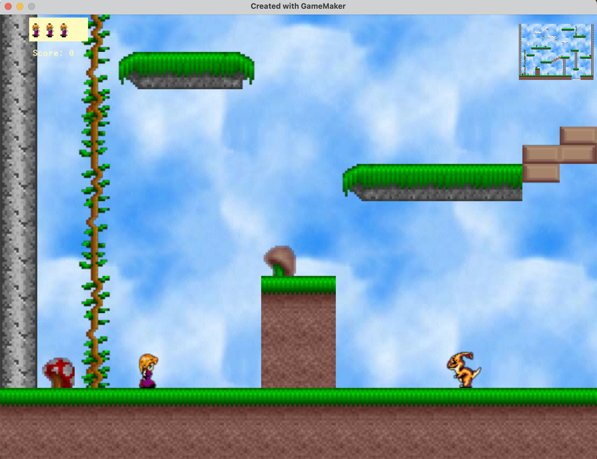

# [Your Game Name] - A Platformer Adventure

  

## 🎮 About the Game
A thrilling platformer created with **GMaker Studio**! Jump, dash, and conquer challenges across vibrant levels. 
## 🕹️ Controls
- **Arrow Keys** / **WASD**: Move character

## 🛠️ Features
- ✅ [X] hand-crafted levels
- ✅ [Unique mechanic, e.g., "Wall-jumping"]
- ✅ [Collectibles, e.g., "100+ hidden gems"]

## 📥 Installation
1. Download the latest release from [GitHub Releases](#) *(add link)*
2. Extract the ZIP file
3. Download GameMaker studio  and opoen the .yyp file

## 🧑‍💻 Development
Built with **GMaker Studio**. To modify:
1. Clone this repo
2. Open `project.gmx` in GMaker Studio
3. Edit sprites/levels in the editor

## 📜 Credits
- **Code/Art**: Khaled Mohamed Ali

## 📄 License
[Specify license, devcircuit] - See `LICENSE` file for details.

---
⭐ **Enjoy the game!** Leave feedback via  khaled@devcircuit.net.
